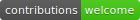
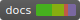
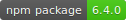

# UnderNode &trade; Labs - Copyright &copy; 2018

   

**StopDrug API REST**

*Dependencies*

```javascript
nodejs      ^9.11.2
npm         ^6.4.0
express     ^4.16.0
aes256      ^1.0.4
body-parser ^1.18.3
chalk       ^2.4.1
debug       ^3.1.0
express     ^4.16.3
faker       ^4.1.0
hawk        ^7.0.7
http-errors ^1.7.0
js-base64   ^2.4.8
moment      ^2.22.2
morgan      ^1.9.0
multer      ^1.3.1
ora         ^3.0.0
sprintf-js  ^1.1.1
```
*Install guide*

```bash
#Go to root folder
cd api #or name api folder
#Next step
npm i
```
_Run guide_

```bash
#Wait to install ends and input
npm start #default command is '--init'
#or
node run.js [command] #command is require
```

# Author

> @blacknode
